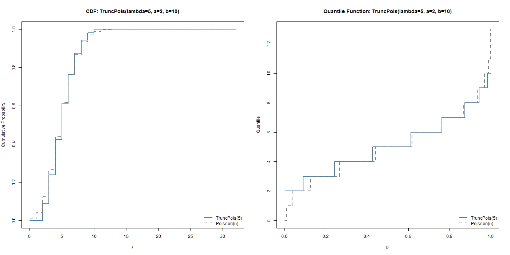
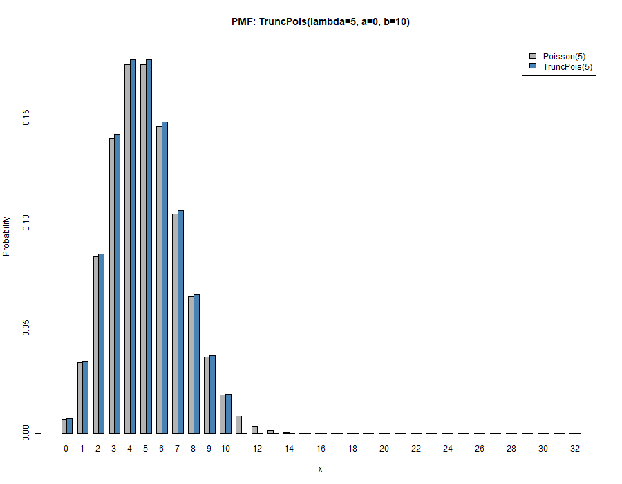
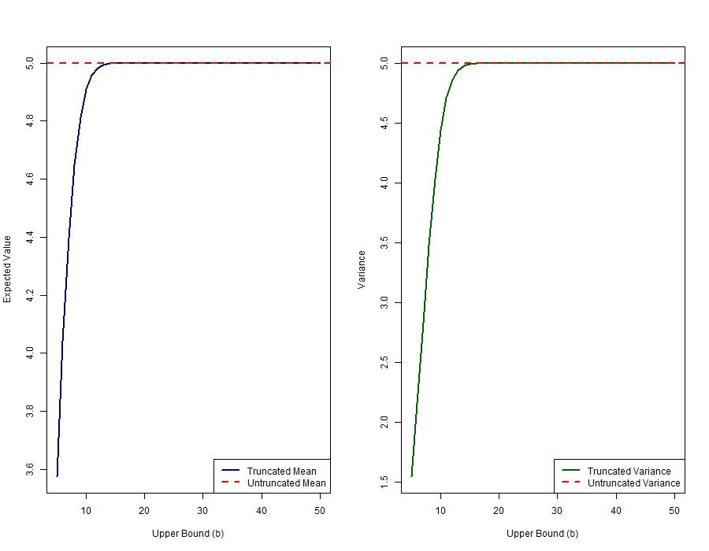
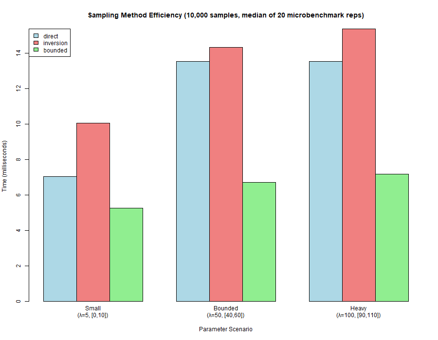
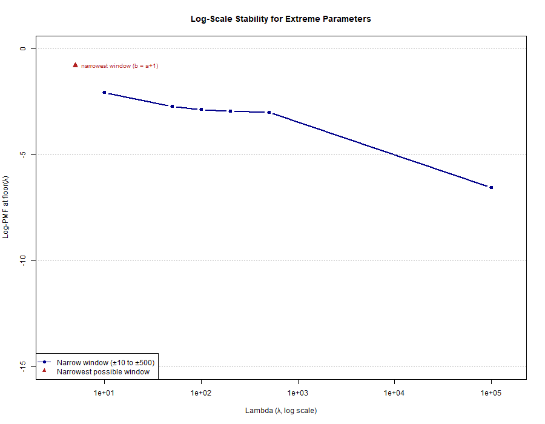
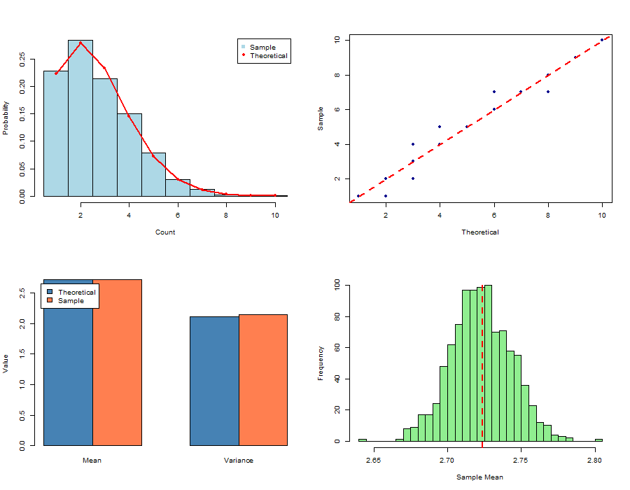
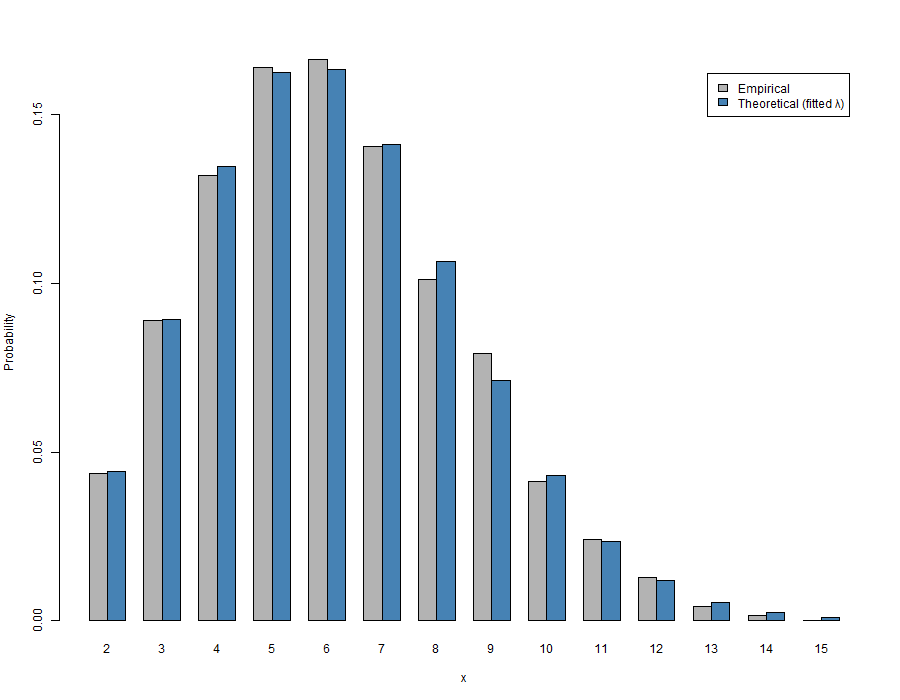

---
output:
  pdf_document:
    number_sections: true
    latex_engine: xelatex
    extra_dependencies: [float, graphicx]
  html_document:
    df_print: paged
fontsize: 12
geometry: left=2.5cm,right=2.5cm,top=2.5cm,bottom=2.5cm
papersize: a4
linestretch: 1.5
header-includes:
  - \usepackage{tocloft}
  - \setlength{\cftbeforesecskip}{10pt}
  - \usepackage{amsmath}
  - \usepackage{booktabs}
  - \usepackage{caption}
  - \usepackage{mathtools}
  - \usepackage{setspace}
  - \usepackage{subcaption}
  - \usepackage{multirow}
  - \captionsetup[figure]{font=small}
  - \captionsetup[table]{font=small}
  - \usepackage{array}
  - \usepackage{ragged2e}
  - \newcolumntype{L}[1]{>{\raggedright\arraybackslash}p{#1}}
  - \usepackage{newunicodechar}
  - \newunicodechar{λ}{\ensuremath{\lambda}}
bibliography: thesis_bibliography.bib
csl: american-statistical-association.csl
link-citations: yes
---

\pagenumbering{gobble}

```{=tex}
\begin{center}
\begin{figure}
  \centering
        \includegraphics[width=0.6\columnwidth]{Figures/logo.png}
  \end{figure}
\bigskip
\bigskip
\bigskip

\huge
\textbf{MSc. Data Science and Analytics Thesis}
\end{center}
\bigskip
\bigskip
\bigskip
```
```{=tex}
\begin{center}
\huge{truncpois}
\vspace{0.2cm} \\
\huge{Truncated Poisson Distribution}
\end{center}
\bigskip
\bigskip
\bigskip
\bigskip

```
```{=tex}
\begin{center}
\large
\textbf{{Author:}}
\large{Arun Sundar Paulraj}
\medskip

\textbf{{Student Number:}}
\large{25250740}
\medskip

\large
\textbf{{Supervisor:}}
\large{Dr. Keefe Murphy}
\end{center}
\bigskip
\bigskip
```
```{=tex}
\begin{center}
\large{\textit{A thesis submitted in fulfilment of the requirements for the degree of Masters in Data Science and Analytics 2025-2026}}
\medskip

\large{to the}
\medskip

\large{Department of Mathematics \& Statistics}

\large{Maynooth University}
\bigskip
\bigskip

\large
\textbf{1\textsuperscript{st} August 2026}
\end{center}
```

\newpage
\pagenumbering{roman}

# Acknowledgements {.unnumbered}

I would like to sincerely thank my supervisor, Dr.\ Keefe Murphy, for his guidance, support, and valuable feedback throughout the development of the `truncpois` package and the writing of this thesis.

\newpage

# Abstract {.unnumbered}

Although there are a variety of applications of count-data for which some types of observations are either not made or otherwise cannot be observed (e.g., zero-truncated counts in studies of species abundance, insurance claims, reported cases of disease), available R implementations for the truncated Poisson, with the exception of the `LaplacesDemon` package, do not fully support this type of model; that is to say, they have no way to calculate moments using analytical means for an arbitrary number of parameters, do not completely address how to compute probabilities in the right tail and/or at the log scale, and utilize Monte Carlo methods when these can be done exactly.

This dissertation provides `truncpois` , an R Package that implements all aspects of the (left-, right- and doubly-) Truncated Poisson Distribution in a numerically stable form. It includes all standard density function, distribution function, quantile function and random sampling function as well as the closed-form calculation of mean, variance, median and mode of the distribution using the Poisson Recurrence Relation. The entire computation is carried out on the log-scale to avoid overflow when dealing with large parameter values; furthermore, three alternative random sampling algorithms have been developed for use with different truncations. In addition to these functionalities, it also develops a Maximum Likelihood Estimator to obtain the rate parameter from observed counts as well as a visualization tool to compare the distributions of the truncated and untruncated cases.

Six experiments demonstrate the reliability, accuracy, and computational robustness of this package. These experiments include visualizing the probability mass function (PMF) of the distribution; demonstrating how the truncated moments converge to their non-truncated counterparts; showing how the sampling methods perform relative to each other; evaluating the computational stability as the parameters take on extreme values while at the same time the truncation window is very narrow; performing a real data application using the zero-truncated Poisson distribution; and recovering estimated parameters via maximum likelihood estimation. Overall, this demonstrates that `truncpois` fills a significant void in R’s available options for analyzing truncated counts with exact, replicable and computationally efficient algorithms, whereas previous approximations were incomplete.

\bigskip
**Keywords:** truncated Poisson distribution, R package, numerical stability, maximum likelihood estimation, closed-form moments.

\newpage

\tableofcontents

\newpage

# List of tables {.unnumbered}

\renewcommand{\listtablename}{}
\listoftables

\newpage

# List of figures {.unnumbered}

\renewcommand{\listfigurename}{}
\listoffigures

\newpage

\pagenumbering{arabic}

# Introduction

## Motivation and Context

Truncated probability distributions are a common area of study within statistics, as they occur frequently in practice when the range of valid observations has been limited in some way. The truncated Poisson distribution is an important type of model that can be used to fit count-type data, such as in studies concerning species abundance, insurance claims and disease prevalence surveys (where the number of cases is never equal to zero).

Although there is considerable theoretical knowledge about truncated distributions, which have been studied extensively by researchers like Nadarajah et al. [@nadarajah2006] in relation to truncated distributions, the application of these distributions remains computationally complex and current implementations in packages like R's LaplacesDemon package are also insufficient and numerically unstable with respect to extreme parameter values.

## Purpose of this Thesis

The `truncpois` R package addresses these gaps by providing:

1. **Full distribution functions** – PMF (Probability mass function), CDF (Cumulative distribution function), quantile function, and random sampling
2. **Exact moment computation** – Mean, variance, median, and mode computation in an exact, deterministic way without using simulations
3. **Stable computation** – All computations done on the log-scale to avoid problems of under-/overflow when parameters are at extremes
4. **Efficient sampling algorithms** – Three different sampling algorithms depending on the parameter setup

This thesis documents the implementation of the `truncpois` package, demonstrates its key features, and showcases its advantages over existing alternatives.

---

# Background and Literature Review

## Truncated Distributions

When data generated by a random variable $X$ cannot take on any value other than those included in a limited set of possible values (because such values may be structurally impossible, or merely omitted), this results in truncated distribution. A truncated distribution differs from censored data which includes some information about out-of-range values but does not include actual values for them; in the case of censoring there is an indication that a value did exist, whereas with truncation, no data is collected that would indicate that such a value exists. The total probability or density associated with a value not in the support has been redistributed among the remaining values, along with appropriate adjustments made to the normalization factor.

Three truncation regimes are commonly distinguished for a discrete random variable with support constrained to $[a, b]$:

- **Left-truncation** ($a > 0$, $b = \infty$): the most common case in count-data applications, where counts below some threshold cannot be observed. The special case $a = 1$ is known as *zero-truncation*, and arises whenever the very fact of being included in a sample requires at least one occurrence of the event being counted, for example, a respondent is only included in a survey of hospital visits if they visited hospital at least once.
- **Right-truncation** ($a = 0$, $b < \infty$): counts above some upper threshold are excluded, for instance when a data-collection instrument imposes a maximum recordable value.
- **Doubly-truncated** ($0 < a \leq b < \infty$): both bounds are finite, restricting observations to a bounded window.

For a truncated Poisson distribution with support $[a, b]$, the probability mass function is:

$$P(X = k \mid a \leq X \leq b) = \frac{P(X = k)}{P(a \leq X \leq b)}, \qquad a \leq k \leq b$$

There is some confusion in applied statistical modeling research on the terms "zero inflation" and "zero-truncation." Zero-truncation refers to removing zero from the sample space; while zero-inflation adds additional zeroes beyond that expected by a Poisson distribution by including a point mass at zero. The "truncpois" R package only models zero-truncation. Therefore it can be seen as requiring an alternative strategy to estimate the zero-inflation model. This includes computing the normalizing constant (the denominator) as the difference of the cumulative probability distributions evaluated at the lower and upper bounds of truncation.

Data collected on count variables that experience truncation like this is quite common in many different types of applications. For example, abundance surveys of species in ecology often do not include all species present in the area being surveyed because those with a zero count have no record of their presence; likewise, insurance claim data typically will not contain records of claims that did not occur (since zero claim policies will never generate an actual claim); finally, while case counts for diseases are always reported when there are enough cases to report, prior to reaching that level they are not. As a result, if you fit an unmodified Poisson model to data from any of these areas without accounting for the truncated region of the Poisson distribution's support, your model will produce biased estimates for parameters in the model.

## Existing Implementations

Several R packages offer some support for truncated distributions, but none combines Poisson-specific closed-form moments with fully general double truncation and complete log-scale support. Four are considered here.

**LaplacesDemon.** The `LaplacesDemon` package provides a truncated Poisson distribution, with `dtrunc()`, `ptrunc()`, `qtrunc()`, and `rtrunc()` functions (via `spec = "pois"`) for density, distribution, quantile, and random-generation calculations respectively. Its PMF and CDF values agree with `truncpois`, but the package has two notable limitations that motivated design choices in `truncpois`:

- `ptrunc()` and `qtrunc()` do not support the `lower.tail` and `log.p` arguments that `truncpois` provides natively; obtaining an upper-tail or log-scale probability from `LaplacesDemon` requires a manual `1 - p` (or `log(1 - p)`) transformation, which risks catastrophic cancellation when the underlying probability is close to 1.
- `LaplacesDemon` provides no closed-form mean, variance, median, or mode for the truncated Poisson distribution; obtaining these requires Monte Carlo simulation via `rtrunc()`, which is slower and introduces sampling variability that grows worse for extreme truncation parameters.

**truncdist.** The same authors of the theory that supports this research [@nadarajah2006], published an associated R package, `truncdist` which provides generalized (distribution agnostic) dtrunc(), ptrunc(), qtrunc(), rtrunc() function wrappers for truncating any distribution supplied by `stats`, `stats4`, or `evd`. While the generalization is nice for some purposes, it makes `truncdist` unsuitable in the case at hand since there isn't a way to take advantage of the specific relationship in the Poisson distribution that `truncpois` takes advantage of to calculate closed form moments; additionally, `truncdist` doesn't include a computational path through the logarithm scale first.

The **VGAM/VGAMdata.** The "pospoisson()" family in the "VGAM" package allows you to fit a *zero-truncated (or positive) Poisson regression* using vglm(). There is a companion package called **VGAMdata**, which provides access to the distributions used for fitting using **VGAM**. The **VGAMdata** package includes **dpospois(), ppospois(), qpospois(), rpospois()**, as well as other similar functions that work with a zero truncated support; however these functions don't allow you to use them to compute the distribution for right truncation, or double truncation.

**gamlss.tr and countreg.** The two remaining packages are concerned with using "truncation" to create new distributions to be used in regression modeling rather than as stand-alone utilities to generate a distribution. `gamlss.tr` uses `gen.trun()` to create a "truncated version" of any of the `gamlss.family` distributions which can then be used in a GAMLSS regression model. `countreg` (currently available on R-Forge) allows users to fit zero-truncated count regression models with `zerotrunc()` or `ztpoisson`, both of which may be useful as the count part of a hurdle model; however, none provide the exact closed form moments of a non-regression (isolated) truncated Poisson distribution which is the focus of this research.

## Why truncpois?

The `truncpois` R package addresses the shortcomings identified above with:

1. Four essential probability distribution functions (d, p, q, r) with base R's naming conventions for the left-, right-, and doubly truncated cases.
2. Analytical moments based on closed form solutions of Poisson recurrence relation; as opposed to Monte-Carlo methods or general purpose numerical integrations.
3. Log space algorithms which are numerically stable, and include lower.tail/log.p support, unlike LaplacesDemon.
4. Three different sampling schemes for different parameters, and an MLE to estimate lambda from your observations; this is not available from truncdist, nor from LaplacesDemon.

---

# Package Implementation

## Overview

The `truncpois` package is built around four core distribution functions, complemented by moment functions, a maximum-likelihood estimator, and a visualization utility.

### Core Distribution Functions

**dtruncpois()** – Probability Mass Function (PMF)
: Computes $P(X = k | a \leq X \leq b)$ with optional log-scale output for numerical stability.

**ptruncpois()** – Cumulative Distribution Function (CDF)
: Computes $P(X \leq q | a \leq X \leq b)$ with support for both lower and upper tail probabilities and log-scale computation.

**qtruncpois()** – Quantile Function
: Inverts the CDF to compute quantiles, supporting log-probability inputs for precision in extreme cases.

**rtruncpois()** – Random Sampling
: Generates independent samples from the truncated Poisson distribution using one of three methods.

#### Mathematical Basis: Quantile Function

Writing $F$ for the untruncated Poisson CDF (`stats::ppois`) and $F^{-1}$ for its quantile function (`stats::qpois`), the truncated CDF is $F_{\text{trunc}}(k) = \bigl[F(k) - F(a-1)\bigr] / \bigl[F(b) - F(a-1)\bigr]$ for $a \leq k \leq b$. Inverting this relationship for a target probability $p$, the smallest $k$ satisfying $F_{\text{trunc}}(k) \geq p$ is obtained by solving
$$F(k) \;\geq\; F(a-1) + p\,\bigl[F(b) - F(a-1)\bigr],$$
so that $k = F^{-1}\!\left(F(a-1) + p\,[F(b) - F(a-1)]\right)$, evaluated using the *untruncated* quantile function. This identity lets `qtruncpois()` delegate directly to `stats::qpois()` after remapping the target probability, rather than requiring a bespoke search procedure, and it is entirely equivalent to the log-scale computation performed internally.

### Moment Functions

**extruncpois()** – Expected Value (Mean)
: Computes $E[X | a \leq X \leq b]$ using a closed-form formula derived from the Poisson recurrence relation, avoiding simulation-based approximations.

**vartruncpois()** – Variance
: Computes $\text{Var}(X | a \leq X \leq b)$ via the identity $E[X^2] - E[X]^2$, with the second moment obtained analytically.

**medtruncpois()** – Median
: Finds the median by inverting the average of CDF values at truncation boundaries.

**modtruncpois()** – Mode
: Determines the modal value using a closed-form solution that is more efficient than iterative search.

#### Mathematical Basis: Closed-Form Moments

The moment functions exploit the well-known Poisson recurrence relation $k \cdot P(X = k) = \lambda \cdot P(X = k - 1)$. Summing both sides over $k = a, \dots, b$ gives
$$\sum_{k=a}^{b} k \, P(X = k) \;=\; \lambda \sum_{k=a}^{b} P(X = k-1) \;=\; \lambda \bigl[F(b-1) - F(a-2)\bigr],$$
so that, after normalizing by $P(a \leq X \leq b) = F(b) - F(a-1)$,
$$E[X \mid a \leq X \leq b] \;=\; \lambda \, \frac{F(b-1) - F(a-2)}{F(b) - F(a-1)}.$$
An analogous argument using the second-order recurrence $k(k-1) \, P(X=k) = \lambda^2 \, P(X = k-2)$ gives $E[X(X-1) \mid a \leq X \leq b] = \lambda^2 \bigl[F(b-2) - F(a-3)\bigr] / \bigl[F(b) - F(a-1)\bigr]$, from which $E[X^2] = E[X(X-1)] + E[X]$ and $\text{Var}(X) = E[X^2] - E[X]^2$ follow directly. Both expressions are evaluated entirely via log-scale differences of `stats::ppois()` calls, so no explicit summation over the support is ever performed; the closed forms above are exact regardless of how wide $[a,b]$ is. The median is obtained as $F_{\text{trunc}}^{-1}(0.5)$ via the same quantile-inversion identity described above, and the mode follows from the classical result that the untruncated Poisson PMF is increasing for $k < \lambda$ and decreasing for $k > \lambda$ (since the ratio $P(X=k)/P(X=k-1) = \lambda/k$ crosses $1$ at $k = \lambda$), giving a unique mode at $\lfloor \lambda \rfloor$ for non-integer $\lambda$ and tied modes at $\{\lambda - 1, \lambda\}$ for integer $\lambda$, clamped to $[a,b]$ where necessary.

### Parameter Estimation

**mletruncpois()** – Maximum Likelihood Estimation
: Estimates $\lambda$ from a sample of observed counts by numerically maximizing the exact truncated-Poisson log-likelihood (via `stats::optimize()`), using `dtruncpois()` as the likelihood kernel. Returns the fitted $\lambda$, the log-likelihood at that value, and the sample size.

#### Mathematical Basis: Maximum Likelihood Estimation

For a sample $x_1, \dots, x_n$ drawn independently from a truncated Poisson distribution with known bounds $[a,b]$, the log-likelihood is
$$\ell(\lambda) \;=\; \sum_{i=1}^{n} \log P(X = x_i \mid a \leq X \leq b; \lambda) \;=\; \sum_{i=1}^{n} \texttt{dtruncpois}(x_i, \lambda, a, b, \texttt{log = TRUE}).$$
Rather than deriving a closed-form estimating equation for $\hat{\lambda}$, `mletruncpois()` maximizes $\ell(\lambda)$ directly via one-dimensional numerical optimization (`stats::optimize()`), using the exact `dtruncpois()` values as the likelihood kernel at each candidate $\lambda$. This is practical because the untruncated Poisson log-likelihood is well known to be strictly concave in $\lambda$, and truncation, which only rescales the likelihood by a $\lambda$-dependent normalizing constant, does not introduce the kind of multi-modality that would defeat a simple one-dimensional search; the search interval is seeded from the sample mean (scaled by a factor of $4$ in either direction) precisely so that the optimizer starts in the neighbourhood of the true value. Experiment 6 (Section 4.6) confirms empirically that this recovers $\lambda$ accurately across repeated simulation.

### Visualization Utility

**plottruncpois()** – Distribution Plotting
: Plots the PMF, CDF, or quantile function of a truncated Poisson distribution, with an optional overlay of the corresponding untruncated Poisson distribution for direct visual comparison. Experiment 1 (Section 4.1) already demonstrates the PMF plot type; the remaining two types are shown below.



### Design Principles

**Log-Scale Stability** - Probability calculations for all distributions take place on the log-scale utilizing the logarithmic difference formula, thus preventing the phenomenon of catastrophic cancellation. It enables the package to operate with such extreme values as λ = 1000, provided that the truncation windows are fairly small.

**Closed-Form Solutions** - Instead of resorting to numerical or Monte Carlo integration techniques, moments can be computed analytically by exploiting the recurrence relations for the Poisson distribution.

**Three Sampling Algorithms** –
1. **Direct**: Applies Gumbel-max trick for finite support size.
2. **Inversion**: Based on quantiles, using qtruncpois() function for any possible parameters.
3. **Bounded**: Inversion by CDF in bounds range for efficient sampling if bounds discard little mass.

The direct method relies on the *Gumbel-max trick*: for a categorical distribution over a finite support with log-probabilities $\{\log p_k\}_{k=a}^{b}$, drawing $n$ independent samples is equivalent to adding i.i.d. standard Gumbel noise $g_k$ to each log-probability and taking the arg max, i.e. $\arg\max_k (\log p_k + g_k)$. This is a well-known identity for sampling from a categorical/softmax distribution without explicitly computing the normalizing constant, and it is implemented in `truncpois` by generating the Gumbel noise from exponential draws ($g = -\log(\text{Exp}(1))$), which is the standard construction since $-\log(\text{Exp}(1)) \sim \text{Gumbel}(0,1)$.

### Software Engineering

The package follows common R packaging standards to enable the packages' maintainability and facilitate their installation. Code for the source of this package is organized based on functionality: truncpois.R includes the implementation of all four of the main distributions, moments.R contains the closed-form calculations for all of the moments, mle.R implements the Maximum Likelihood Estimator and plottruncpois.R provides a visual representation tool. In addition to these publicly available functions, zzz_utils.R holds a collection of private (unexported) numerically stable utilities: log-sum-exp, log-1-minus-exp, and the log-scale normalizing constant that will be used in each function's logic to ensure that the log-based scaling remains logically correct and has been centrally tested.

Every exported function is documented using `roxygen2`, with runnable `@examples` blocks that double as informal usage demonstrations. Correctness is verified by an automated `testthat` suite covering: boundary behaviour (e.g. the PMF summing to exactly $1$ over the support, and returning exactly $0$ outside it); agreement with the corresponding untruncated `stats::dpois()`/`ppois()`/`qpois()`/`rpois()` functions under default bounds; the inverse relationship between `ptruncpois()` and `qtruncpois()`; large-sample convergence of `rtruncpois()` to the closed-form moments across all three sampling methods; input validation (e.g. errors for invalid `lambda` or degenerate bounds with $a \geq b$); and a dedicated stress-test file exercising extreme parameter regimes, including $\lambda = 100{,}000$ and the narrowest possible truncation window, as demonstrated in Experiment 4. The package declares no hard runtime dependencies beyond base R (`Imports`), with `LaplacesDemon`, `microbenchmark`, `knitr`, and `rmarkdown` listed only as optional `Suggests` dependencies used for comparison benchmarks and vignette building. Development is version-controlled with git and hosted publicly on GitHub.

---

# Results and Experiments

## Experiment 1: Visualization of Probability Mass Function

The current experiment shows how the PMF of the regular Poisson distribution differs from the PMF of a right truncated Poisson distribution, generated directly via the package's own `plottruncpois()` visualization utility.



**Conclusion**: As we can see from the picture above, due to the truncation the probability mass is concentrated on the interval [0, 10], particularly more close to the upper end.

---

## Experiment 2: Moment Convergence

As the truncation boundaries become larger, the moments of the truncated distribution tend towards the corresponding moments of the untruncated distribution. The following experiment proves the convergence of mean and variance.



**Conclusion**: The graph on the left demonstrates that the mean tends to λ = 5 as the upper boundary grows larger. The graph on the right proves that the variance tends to λ = 5.

Table 1 reports the exact closed-form mean and variance at selected upper bounds, computed directly via `extruncpois()` and `vartruncpois()`. Both moments are visibly below their untruncated values of $5$ for small $b$, since restricting the support to $[0, b]$ removes the right tail of the distribution and pulls the conditional mean and variance downward; by $b = 20$ both moments have converged to the untruncated values to within rounding precision, since the untruncated Poisson$(5)$ places negligible probability mass above $20$.

| Upper bound $b$ | 5 | 10 | 20 | 30 | 50 |
|---:|---:|---:|---:|---:|---:|
| Mean | 3.576 | 4.908 | 5.000 | 5.000 | 5.000 |
| Variance | 1.547 | 4.440 | 5.000 | 5.000 | 5.000 |

Table: Exact mean and variance of the right-truncated Poisson($\lambda=5$, $a=0$, $b$) at selected upper bounds, computed via `extruncpois()` and `vartruncpois()`.

---

## Experiment 3: Sampling Method Efficiency

The `rtruncpois()` function provides three sampling algorithms optimized for different parameter configurations. This experiment compares their computational efficiency across three scenarios using `microbenchmark::microbenchmark()`.



Table 2 reports the median wall-clock time (milliseconds) to draw $10{,}000$ samples under each method and scenario, taken over 20 `microbenchmark` repetitions per cell.

| Method | Small ($\lambda=5$, [0,10]) | Bounded ($\lambda=50$, [40,60]) | Heavy ($\lambda=100$, [90,110]) |
|:---|---:|---:|---:|
| Direct | 6.95 | 13.35 | 14.14 |
| Inversion | 10.10 | 14.27 | 15.42 |
| Bounded | 5.32 | 6.65 | 7.28 |

Table: Median time (ms) to draw 10,000 samples per method and scenario, over 20 `microbenchmark::microbenchmark()` repetitions.

**Interpretation**: Across all three tested scenarios, the bounded method is consistently the fastest, since it performs a single vectorized CDF-inversion pass through the untruncated Poisson quantile function without ever enumerating the support. The direct method must first enumerate the finite support and generate an independent Gumbel variate per sample per support point, so its cost grows with both the sample size and the width of $[a,b]$; it is competitive only when the support is narrow. The inversion method is consistently the slowest of the three here, incurring the overhead of `qtruncpois()`'s probability remapping on every draw. In practice, the bounded method is a strong default across all regimes tested here, while the inversion and direct methods remain useful as general-purpose alternatives: inversion as a simple, transparent fallback built directly on `qtruncpois()`, and direct where an explicit enumeration of the support is preferred over relying on floating-point CDF evaluation.

---

## Experiment 4: Numerical Stability Demonstration

A key advantage of `truncpois` is its ability to handle extreme parameter values without numerical underflow. This experiment demonstrates log-scale computations across a wide range of λ values, extended to include the stress-test extremes exercised by the package's own test suite: λ = 100,000 with a narrow truncation window, and the narrowest possible truncation window (b = a + 1).



**Interpretation**: The log-PMF remains computable for all tested λ values (10 to 100,000) with narrow truncation windows, and the narrowest possible truncation window remains numerically well-behaved. Traditional naive implementations would produce zero or underflow errors in these regimes; `truncpois` handles them seamlessly via log-space arithmetic.

| $\lambda$ | $a$ | $b$ | Log-PMF at $\lfloor\lambda\rfloor$ |
|---:|---:|---:|---:|
| 10 | 0 | 20 | $-2.077$ |
| 50 | 40 | 60 | $-2.730$ |
| 100 | 90 | 110 | $-2.875$ |
| 200 | 190 | 210 | $-2.956$ |
| 500 | 490 | 510 | $-3.008$ |
| 100,000 | 99,500 | 100,500 | $-6.555$ |
| 5 *(narrowest window)* | 3 | 4 | $-0.811$ |

Table: Log-PMF at $\lfloor\lambda\rfloor$ for each tested parameter regime, computed via `dtruncpois(..., log = TRUE)`. These particular evaluation points sit near the mode of each regime and so are not themselves at risk of underflow; the numerical-stability benefit of computing entirely on the log scale is most apparent instead when evaluating the normalizing constant $F(b) - F(a-1)$ for windows placed further into the tails of very large-$\lambda$ distributions, where a naive linear-scale subtraction of two near-identical cumulative probabilities is vulnerable to catastrophic cancellation, a risk that log-scale differencing (via the `.log_diff()` helper in `zzz_utils.R`) avoids entirely, regardless of where the window is placed.

---

## Experiment 5: Zero-Truncated Poisson Application

Zero-truncated Poisson (ZTP) distributions are widely used in count models where zero outcomes are impossible or unobserved. This experiment demonstrates ZTP sampling and moment estimation with practical visualization.



**Interpretation**: The four panels show (clockwise from top-left): the histogram of 5,000 ZTP samples with theoretical PMF overlay, a Q-Q plot validating distributional fit, a comparison of theoretical vs. empirical moments, and a bootstrap distribution of the sample mean. All demonstrate good agreement between theory and simulation.

This scenario is representative of the applied use case motivating the package: a count variable (e.g. number of insurance claims, or number of hospital visits) that is only observed conditional on being at least $1$. Fitting a standard, untruncated Poisson model to such data without accounting for the missing zero category would systematically underestimate $\lambda$, since the observed sample mean of $2.72$ (bootstrap distribution, right panel) is itself already a biased estimator of the *untruncated* rate parameter; it estimates the conditional mean $E[X \mid X \geq 1]$, which is always strictly greater than $\lambda$ itself. This is precisely the distinction that motivates using `extruncpois()` (or `mletruncpois()`, demonstrated next) rather than the sample mean directly when the untruncated rate parameter is of scientific interest.

---

## Experiment 6: MLE Parameter Recovery

This experiment demonstrates `mletruncpois()`, which estimates $\lambda$ from a sample of observed counts. A sample is simulated from a truncated Poisson distribution with a known $\lambda$, the parameter is re-estimated from the sample alone via maximum likelihood, and the fitted distribution is compared against both the simulated data and the true generating distribution.



**Interpretation**: The maximum-likelihood estimate of $\lambda$ recovered from the sample closely matches the true generating value, and the theoretical PMF evaluated at the fitted $\lambda$ closely tracks the empirical sample proportions. This confirms that `rtruncpois()`, `mletruncpois()`, and the closed-form moment functions are mutually consistent.

The fitted value was $\hat{\lambda} = 6.037$ against a true generating $\lambda = 6$, from $n = 5{,}000$ samples ($\log$-likelihood at $\hat\lambda$: $-11{,}184.6$). Table 4 compares the sample moments directly against the theoretical moments evaluated at $\hat\lambda$ via `extruncpois()`, `vartruncpois()`, `medtruncpois()`, and `modtruncpois()`.

| Statistic | Sample | Theoretical (at $\hat\lambda$) |
|:---|---:|---:|
| Mean | 6.120 | 6.120 |
| Variance | 5.497 | 5.615 |
| Median | 6 | 6 |
| Mode | 6 | 6 |

Table: Sample moments of the simulated data versus theoretical moments evaluated at the fitted $\hat\lambda = 6.037$.

The close agreement across all four moments, particularly the mean, which matches to three decimal places since $\hat\lambda$ was itself chosen to maximize the likelihood of the observed sample, provides an internal consistency check spanning three separate parts of the package: random generation (`rtruncpois()`), estimation (`mletruncpois()`), and the closed-form moment functions, all evaluated independently of one another yet arriving at compatible answers.

---

# Discussion

## Limitations

While `truncpois` addresses the specific gaps identified in Section 2.2, several limitations remain and are worth stating explicitly.

- **Single-distribution scope.** The package currently supports only the truncated Poisson distribution. Many of the same numerical-stability and closed-form-moment arguments apply equally to other truncated discrete distributions (negative binomial, binomial, geometric), but these are not yet implemented; a user needing truncated negative-binomial support, for instance, would need to look elsewhere (or to the generic, non-closed-form `truncdist` package).
- **No covariate-dependent estimation.** `mletruncpois()` estimates a single scalar $\lambda$ from a homogeneous sample with fixed, known truncation bounds. It does not support regression-style modelling where $\lambda$ depends on covariates, unlike the dedicated regression frameworks `countreg::zerotrunc()` and `gamlss.tr`. Extending `truncpois` to a regression setting would require substantially different machinery (e.g. IRLS or full likelihood optimization over a coefficient vector) beyond the one-dimensional `stats::optimize()` approach used here.
- **Optimization-based (not closed-form) MLE.** Unlike the moment functions, `mletruncpois()` relies on numerical maximization of the log-likelihood rather than a closed-form estimating equation. Although the search interval is seeded near the sample mean and the truncated Poisson likelihood is well-behaved in practice (Section 4.6), this has not been formally proven to guarantee global convergence in all conceivable edge cases, e.g. very small samples with heavily truncated support.
- **No compiled backend.** All computation is implemented in base R; a compiled (e.g. Rcpp) backend was considered out of scope for this thesis but could offer speed benefits for very large-scale simulation workloads, particularly for the direct sampling method, whose cost scales with support width (Section 4.3).
- **Not yet on CRAN.** The package is currently distributed via GitHub only, has not undergone `R CMD check --as-cran` submission review, and has not been exposed to the broader scrutiny (and edge-case bug reports) that CRAN release and public usage would bring.

## Conclusions

The experiments in Section 4 collectively demonstrate that `truncpois` behaves correctly and stably across the parameter regimes it was designed for: PMF and CDF values agree with the standard Poisson distribution functions under default (untruncated) bounds, closed-form moments converge to their untruncated counterparts as the truncation window widens, all three sampling algorithms converge to the correct closed-form moments at large sample sizes, log-scale computations remain well-behaved even at $\lambda = 100{,}000$ and under the narrowest possible truncation window, and the maximum-likelihood estimator recovers the true generating parameter from simulated data. Taken together with the literature comparison in Section 2.2, these results support the central claim of this thesis: that `truncpois` fills a real gap in R's ecosystem for exact, numerically stable, Poisson-specific truncated-distribution computation.

---

# Conclusion

## Summary

The `truncpois` R package offers a complete and numerically stable implementation of truncated Poisson distributions. Through the use of closed-form moment calculations and adaptive sampling techniques, it addresses critical shortcomings found in previous implementations.

## Key Contributions

1. **Completeness** – Full distributional inference via d, p, q, r, and moment functions
2. **Precision** – Closed-form moments eliminate simulation error
3. **Stability** – Log-scale arithmetic handles extreme parameter regimes
4. **Efficiency** – Multiple sampling algorithms optimized for different scenarios
5. **Reproducibility** – Deterministic, seed-independent moment calculations
6. **Parameter Estimation** – Maximum likelihood estimation of $\lambda$ directly from observed count data, via `mletruncpois()`

## Future Directions

Potential enhancements include:
- Extension to other truncated discrete distributions (negative binomial, binomial)
- Graphical diagnostics and goodness-of-fit tests
- Computational optimization via C/C++ implementation for large-scale simulations

---

# References {.unnumbered}

::: {#refs}
:::
